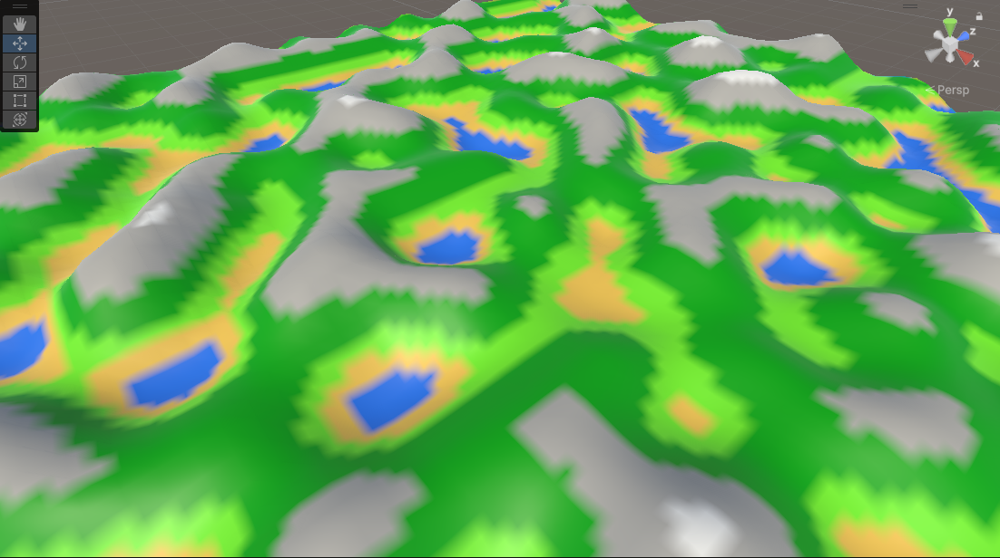

# Map generation

This is a little project about procedural generation of maps.
It is an editor only project. 

First open the project on Unity and open the main scene.

Search for the map generator in the scene hierarchy.

Then you can edit the value of the map generator script and see what happen.

The terrain will show colorized by biomes, but you can remove the colorization to reveal the Perlin noise map on it. You can also find a plane on the scene that show the 2D version on the texture.

